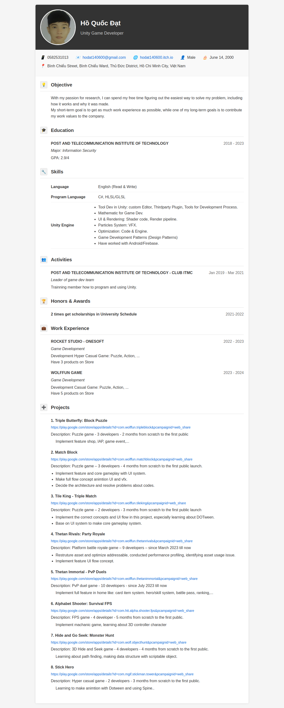

# Hi, I'm Hồ Quốc Đạt 👋

Unity Game Developer with experience in mobile game development.

## 📄 My CV/Portfolio
Check out my [detailed CV and portfolio](https://yourusername.github.io/my-cv/)

## 🎮 Projects
- [Triple Butterfly: Block Puzzle](https://play.google.com/store/apps/details?id=com.wolffun.tripleblock)
- [Match Block](https://play.google.com/store/apps/details?id=com.wolffun.matchblock)
- [Thetan Rivals: Party Royale](https://play.google.com/store/apps/details?id=com.wolffun.thetanrivals)

## 🔧 Skills
- Unity Engine
- C#, HLSL/GLSL
- UI & Rendering
- Game Optimization

# CV Preview

